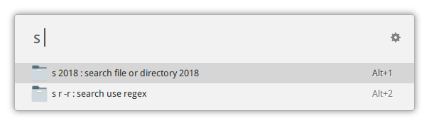
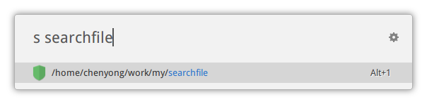
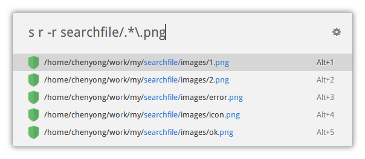
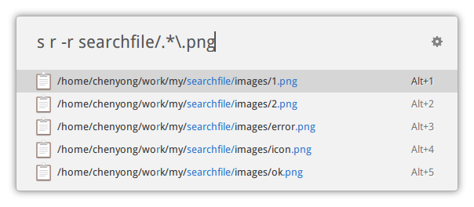

**Note**

This repository will not be maintain anymore!

Instead of wasting time waiting searching command to complete, I chose organising my files orderly. Another good practise may be using your powerfull 'Recent files'.

For files that only used few times, 'find' command would be good. And for me, terminal + locate would work too.

**Old ReadMe**

Extension for [ulauncher](https://ulauncher.io/) to visit your files anytime, anywhere.

The *searchfile* extension use command `locate` to locate file.

Currently it has two modes.

1. Search by basename, equivalent to `locate -b`

2. Raw mode, which pass all argument directly into `locate`. The flowing screenshot demonstrates how to use regex to match files with subfix `png` in `searchfile` direcory(first <u>r</u> is use to trigger <u>r</u>aw mode):

Press Alt+Number to open files using `xdg-open`.

Alternative, you can press Alt-Enter to switch to copy-to-clipboard menu.

