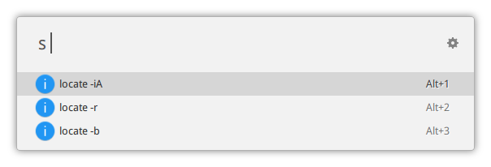

Extension for [ulauncher](https://ulauncher.io/) to visit your files anytime, anywhere.

The *searchfile* extension use command `locate` to locate file.

Currently it has two modes.

1. Search by basename, equivalent to `locate -b`

2. Raw mode, which pass all argument directly into `locate`. The flowing screenshot demonstrates how to use regex to match files with subfix `png` in `searchfile` direcory:

Press Alt+Number to open files using `xdg-open`.

Alternative, you can press Alt-Enter to switch to copy-to-clipboard menu.

